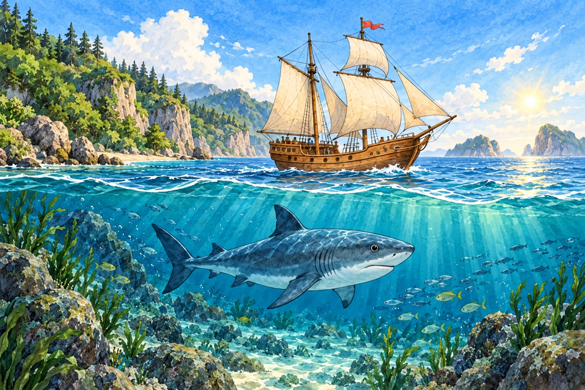
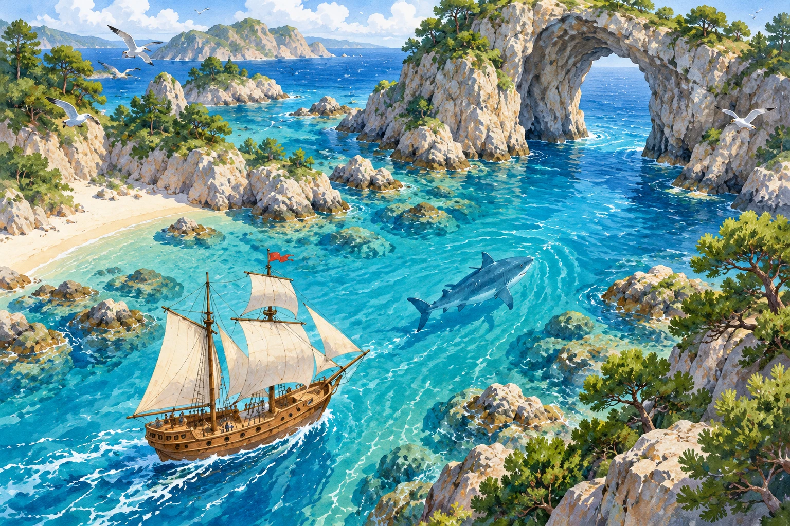
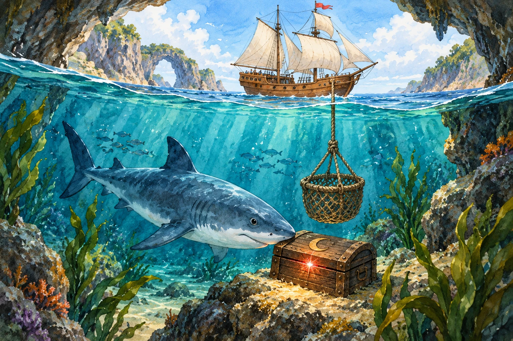
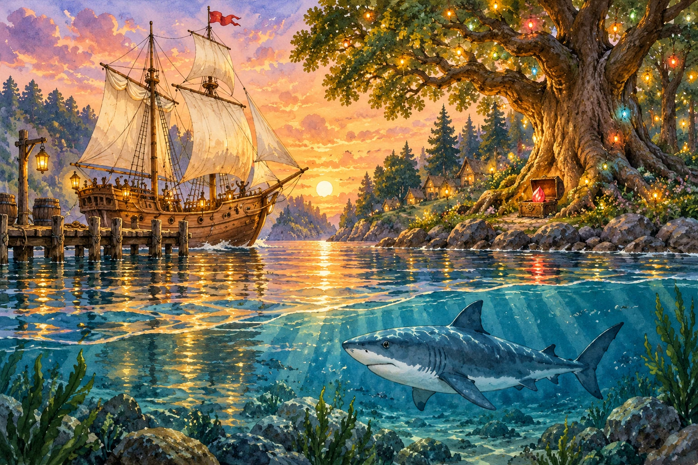

# The Ship and the Kind Shark

Forest Lights chapter 6 replaces The Heart of the Oak with a sea journey starring the ship and kind shark from the original teaching moment.

- Departure: follow the shark’s route clues from bay to arch.
- Safe passage: count the flags still needed to mark the route.
- Underwater treasure: use two clues to choose the moon chest.
- Homecoming: put the seeds in the ring, close it and ring the ship’s bell to restore the forest lights.

The shark is a helpful narrative friend. Existing Moss Golem and Bramble Boar reading encounters and Creature Book stamps remain. Mission ID `oak-heart`, dependencies, ruby seed, learner evidence and river unlock are unchanged. Four legacy oak puzzle definitions retain their original option IDs, wording and answers so pending saves and backups remain playable. New puzzles use separate `shark-*` IDs. New Listen passages use device speech fallback; no paid narration was generated.

## Artwork

Generated with the built-in image tool from the original teaching tile. [Exact prompts and reference crop coordinates](KIND_SHARK_PROMPTS.json). The four 1536 × 1024 paintings are stored in `assets/adventures/kind-shark-*.webp`; original teaching art is unchanged. Riddle answers are defined by text and answer controls, not generated object counts.

## Verification and deployment

315 unit tests and 108 UI flow groups pass. Chrome passes all 12 scene/riddle combinations across three viewports, including treasure completion, with no page errors. The generated art and rendered chapter were visually inspected. A dedicated regression restores and solves each of the four legacy oak riddles from a backup and verifies the river unlock. Deployment pending. Browser regression uses isolated saves and three viewports (1180×820, 768×1024, 390×844). Physical iPad testing is not claimed.
