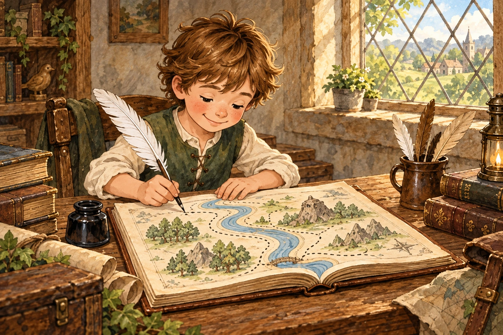
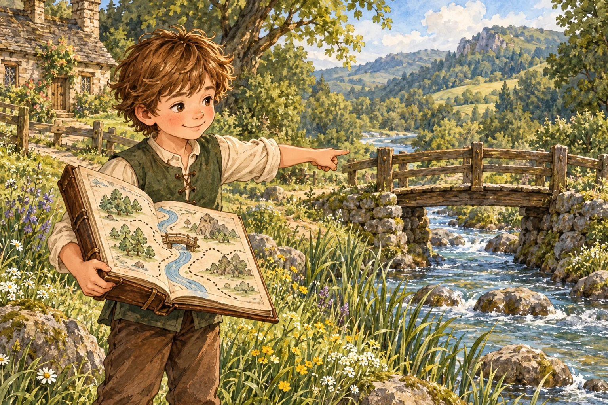
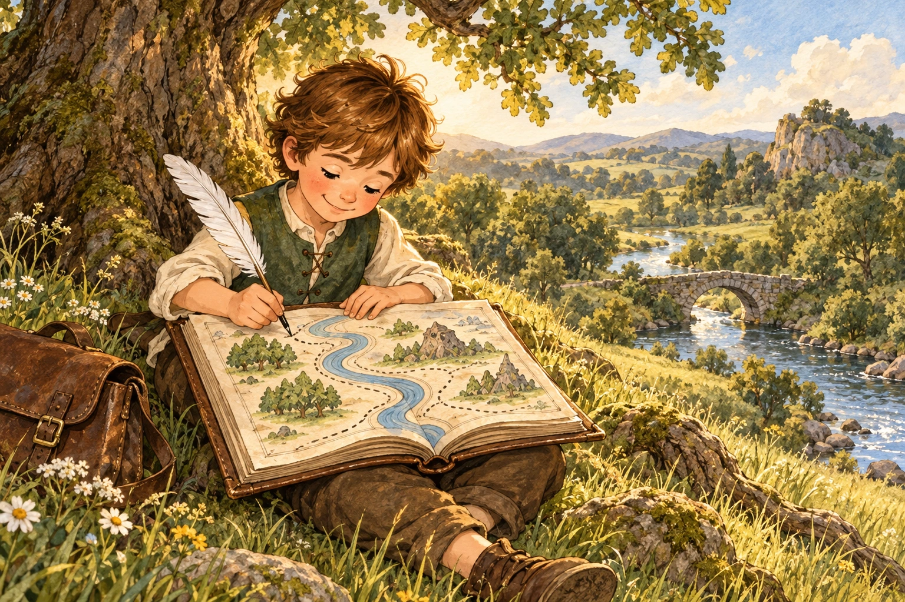
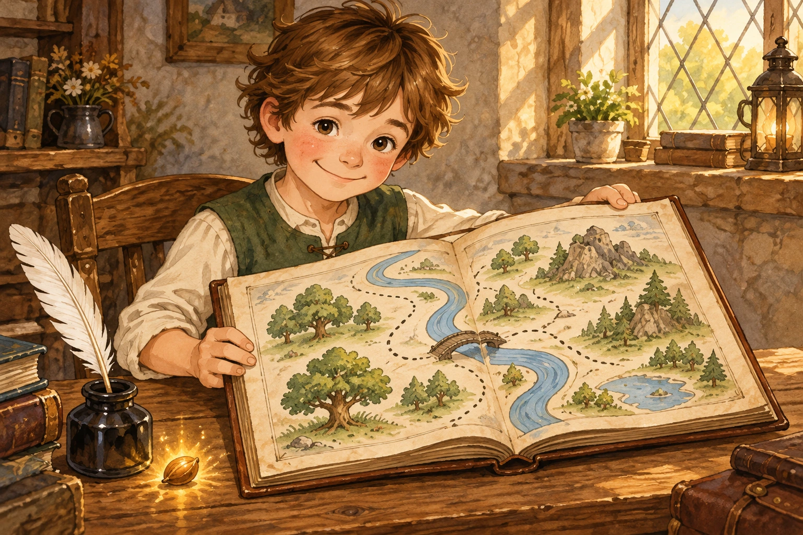
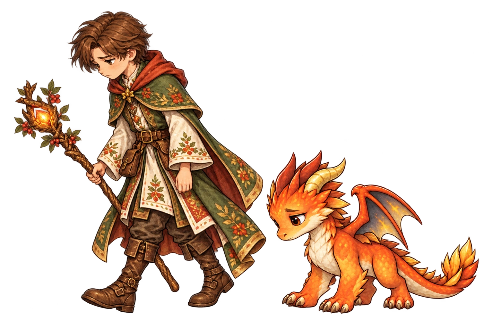

# The Boy and the Map — 6 October 2026

The fifth Forest Lights adventure replaces The Laughing Vault with **The Boy and the Map**, using the user's chosen teaching illustration: the brown-haired boy in a green waistcoat drawing a map in an open book. Its four connected riddles cover choosing a drawing tool, a dry route across the stream, counting map marks and ordering the final drawing steps.

## New chapter artwork

Generated with the built-in image tool from the original teaching-panel reference. Each is an independent 1536×1024 painting, displayed uncropped in the chapter. Existing battle characters remain separate from this story's mapmaker.

Exact prompts and generation paths: [chapter prompts](MAPMAKER_PROMPTS.json). The original teaching atlas is unchanged. The fifth mission retains `mimic-vault` for save compatibility; four new riddle IDs are active, while the original four remain available for pending saves and historical answers. Completed missions, unlocks, collection stamps, XP and curriculum evidence remain. The 44 other active riddles are unchanged. The four new Listen passages use existing device-speech fallback; they are not newly recorded George audio.

## Defeat and retry

A persistent “You lost this round” result shows the approved mage and small Pip, downcast and retreating left together. A short slide moves the new paired illustration; this is not a new frame-by-frame walking clip. Reduced-motion settings keep it still, and Pause/Home cancel the movement. The result remains until the learner retries or returns to camp.

[Retreat prompt and references](RETREAT_PROMPT.json). Creature-quest defeat, including zero hearts in a riddle, stores a destination two **tracker steps** earlier, clamped at step zero. A fight loss returns to the previous fight; a riddle loss returns to the previous clue. Retry restores four hearts once, preserves XP and original answer evidence, and does not recharge companion protection. Completed earlier chapters remain unlocked. Word-trail combat uses the new defeat presentation but keeps its existing checkpoint rules.

## Made/wade investigation

No direct word substitution was reproduced. Tests tap “made” and “wade” in different positions and verify the saved choice, written correction and spoken correction. The button already passes its exact displayed string, not its array position. Added question-ID and connected-button guards to reject stale choice callbacks. Without the original device event/save, this does not establish the cause of the two reported incidents.

## Validation

314 unit tests and 107 UI groups passed. Chrome checked all four chapter scenes and answers, chapter completion, and both fight/riddle defeat with the two-step rewind at 1180×820, 844×390, 768×1024 and 390×844. Screenshots were inspected and the tablet defeat layout corrected. No browser page errors. Physical iPad verification remains unperformed.

Deployment pending; see CURRENT_STATUS.md and the later live hash record for verified release status.
