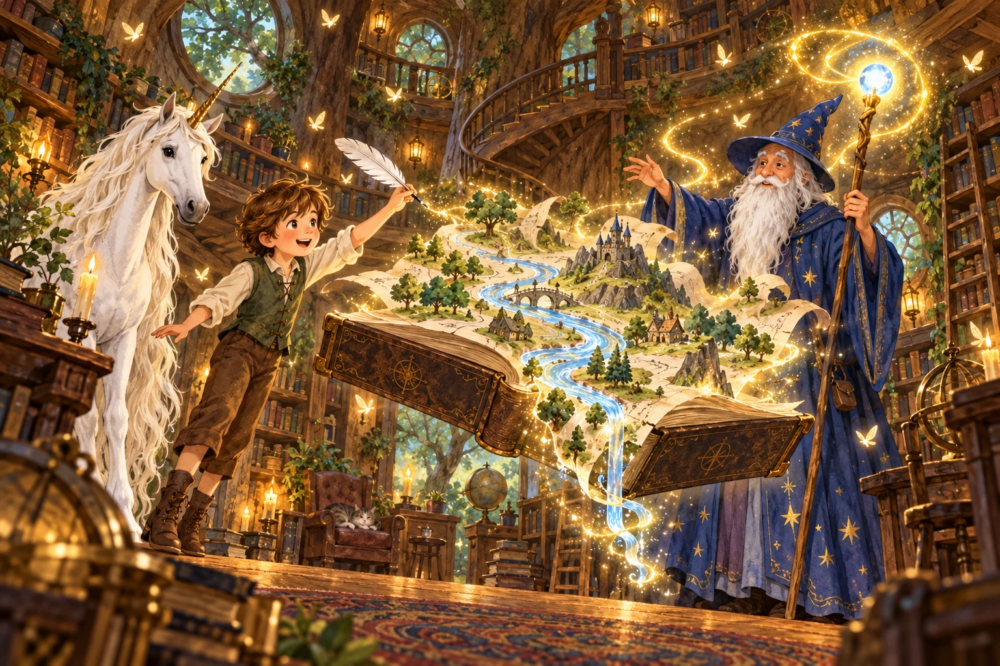
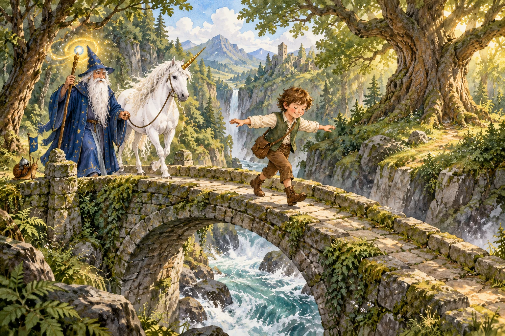
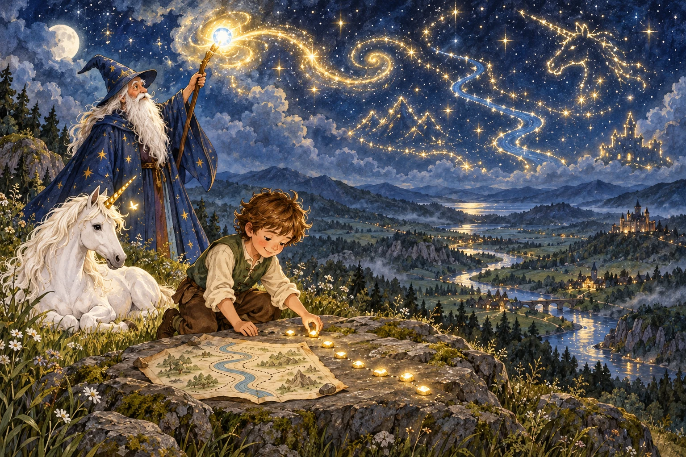
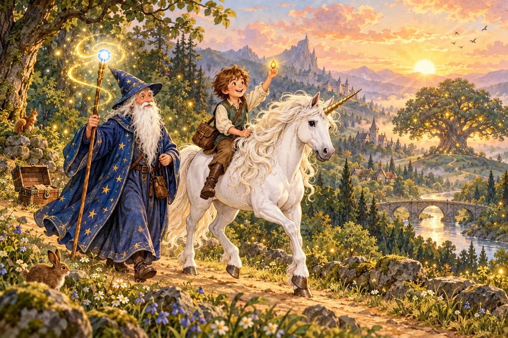

# The boy’s journey with the wizard

The latest artwork direction uses the original boy-and-book teaching picture for character and painted style, and brings back the blue-robed teaching wizard and his unicorn. Four distinct actions, settings and compositions replace the repeated boy-with-open-book scenes in Forest Lights chapter 5, The Boy and the Map.

1. A living river rises from the book in the wizard’s tree library.
2. The boy crosses a stone bridge with the wizard and unicorn following.
3. The wizard lights star paths over a moonlit hill while the boy studies his route.
4. The boy rides the unicorn home at sunrise with the gold light seed.

The story introduction, step transitions and ending match the journey. The mission ID, unlocks, riddle IDs, questions, choices and answers remain stable for existing saves. Prior companion, answer-feedback and retreat fixes remain in place.

## Artwork

Generated using the built-in image tool. Exact prompts: [WIZARD_MAP_PROMPTS.json](WIZARD_MAP_PROMPTS.json). References are crops from the original teaching atlas, not the prior generated chapter pictures. The final scene is also used for the treasure ending.

## Verification

314 unit tests and 107 UI flow groups pass. Chrome verifies all four scene assets, their riddles and the treasure ending; fight/riddle retreat and two-step retry pass at 1180×820, 844×390, 768×1024 and 390×844 with no page errors. Generated art and the rendered chapter were visually inspected. [PR #135](https://github.com/Ikarus-eth/Blitzword_app/pull/135) merged as `fea12a8eb5891620fcb43a61339ce1f74853c905`; [Pages run 37430733004](https://github.com/Ikarus-eth/Blitzword_app/actions/runs/37430733004) succeeded. All six changed live runtime/art files match the tested source. [Live hashes](WIZARD_MAP_DEPLOYMENT.json). Physical iPad testing is not claimed.
